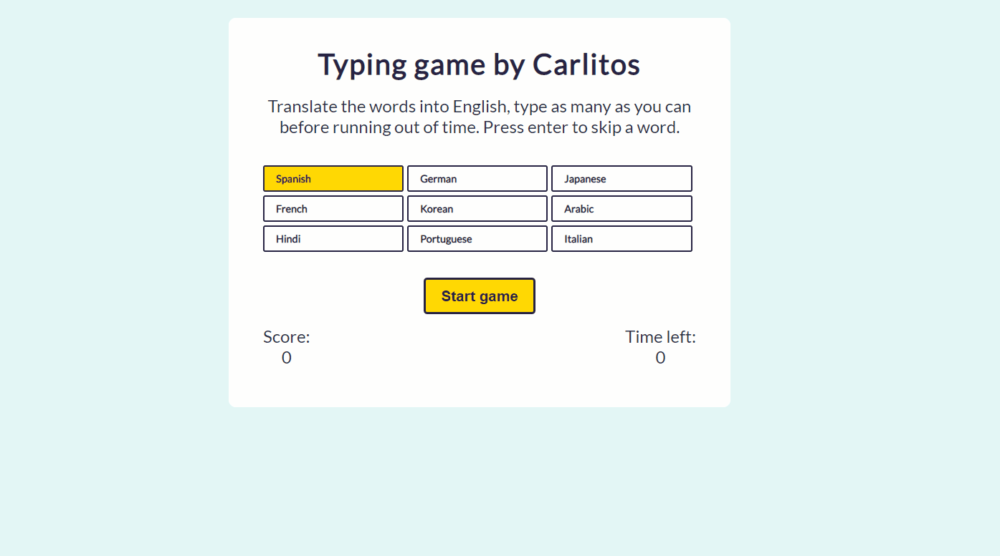

# Typing Game

Enjoy a didactic game built in which you need to translate as many words as posible :book:. This project was made as part of a hackathon with [Mintbean](https://mintbean.io/).

The goal of the game is to translate and type as many words in 30 seconds :hourglass:. Select a language, and click start to play. A random word will be displayed in the selected language, type the word in english to get a new word, or skip it pressing enter.

If you want to see a life version of the game click on this [link](https://fervent-nightingale-812753.netlify.app/)

# Built with

- React
- Google translate API

# Features

- Nine different languages
- Fully responsive :computer: :iphone: :pager: :fax:

# Instalation

If you want to run the application locally, follow the instructions below:

1. Clone the repository.
2. Install Dependencies - Run `npm install` in the root directory.
3. Run `npm start` to start the application.

# Screenshoots

### Desktop version:

### Mobile version:

